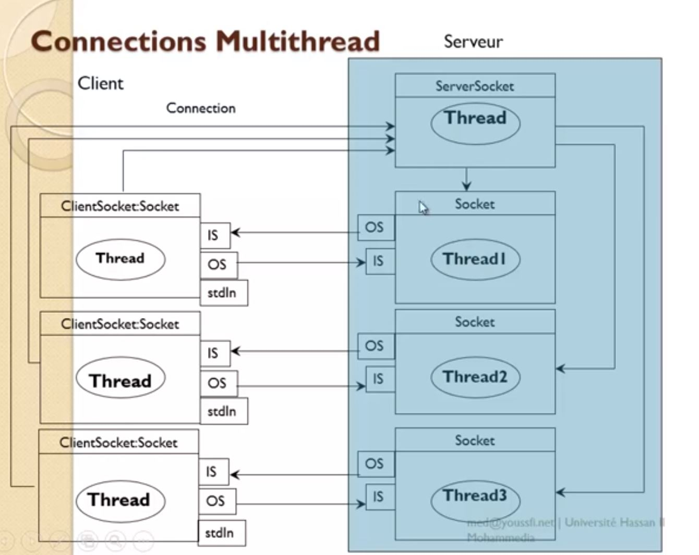

# Création d'un mini-chat en java

## Création du projet.
Alors la première chose, il créer un Projet ``` File -> New -> Java Project  ```. Nommez le "Server"

## Création de la class Server

Ensuite il faut créer une class nommée "Server"  ``` File -> New -> Class ```  
Cochez la case ``` public static void main(String[] args) ```  

Vous devriez avoir ceci 

````java
public class Server {
	public static void main(String[] args) {	
	    // TODO Auto-generated method stub
	}
}
````
### Le Multithread

Contrairement au php ou javascript, java est un langage Multithread. C'est à dire qu'il est capable d'effectuer plusieurs tâches en même temps. On ca donc créer une tâche qui s"occupera de gérer les autres tâches.

On va créer un thread qui va gérer la connexion des utilisateurs. Pour ce faire, il faut qu'on fasse un héritage de la class Thread. En étendant cette class, nous allons devoir redifinir une méthode appellée run(){
}
````java
public class Server extends Thread {
	public static void main(String[] args) {	
	    // TODO Auto-generated method stub
	}
	
	@Override
	public void run() {  // On redifinit la méthode
				
	}
}
````

### Définitions de la méthode main
Dans la méthode ``main`` nous allons utilser notre première objet. On instacie la class server qui va appeller la méthode run ici plus haut.

````java
public static void main(String[] args) {  
	// Creation du socket
	new Server().start();	// 
}
````

### Création du serveur
Ici on ceer un server sur le port 1800. Le seul moyen de dire au serveur que les clients peuvent se connecter n'importe quand c'est en faisant en boucle infinie. Si non le script va s'éxécuter qu'une seul fois lors de la  premiere connexion d'un client et les autres clients n'auront plus acces au server.

````java 
@Override
public void run() {  // On redifinit la méthode
	try {
		ServerSocket ss = new ServerSocket(1800);
		while(true) {				
			Socket socket = ss.accept();
		}

	} catch (IOException e) {
		e.printStackTrace();
	} 

}
````
En java, on est obligé de gérer les erreurs potentiels. Ici on va donc utiliser un try and catch.

Maintenant que nous avons une connexion au serveur nous allons faire des actions.
Tout d'abord nous allons créer une variable int pour donner des id's aux client
````java 
	int idClient;
````
Il faut la mettre en **golbal** donc en début de script. Ensuite dans la boucle while, on incrémente cet id à chaque fois que quelqu'un se connecte. On va mettre aussi un message prévennant qu'un client s'est connecté

````
while(true) {				
	Socket socket = ss.accept();
	System.out.println("Un client vien de se connecter");
	++idClient;				
}
````

vous devriez voir quelque chose comme ça :

````java 
public class Test {	
	int idClient;
	
	@Override
	public void run() {  // On redifinit la méthode
		try {
			ServerSocket ss = new ServerSocket(1800);
			while(true) {				
				Socket socket = ss.accept();
				System.out.println("Un client vien de se connecter");
				++idClient;			
			}			
		} catch (IOException e) {
			e.printStackTrace();
		} 		
	}
	
	public static void main(String[] args) {
		new ServerMT().start();
	}		
}
````

Allez dans le terminal dans votre dossier actuel. 
````bash
cd TPServer/bin
````

Ensuite 
````bash
java Server
````
Il n'y a rien c'est normal. Prenez votre client telnet, et tapez l'adresse ip du server et le port

````bash
telnet 192.168.4.44 1800
````

Vous devriez voir dans la console du serveur : "Un client vien de se connecter"

### Créations des sockets pour chaque client
On va devoir créer une nouvelle class nommée "Conversation" qui étendra également de thread. Pour chaque client connecté, cette class devra être instancié. Si non, on pourrait pas se connecter à plusieurs en même temps sur le serveur.





On peut soit la créer dans un autre fichier, soit faire en créer une dans la class Server. Et c'est ce que nous allons faire. ET puis que c'est une class étendu, on redifinit à noiuveau la méthode run().


````java
class Conversation extends Thread { 
	@Override
		public void run() {
			// TODO Auto-generated method stub
			
		}
}
	
````
Ce qui devrait donner ceci
````java 

public class Serevr {

	int idClient;
	
	@Override
	public void run() {  // On redifinit la méthode
		try {
			ServerSocket ss = new ServerSocket(1800);
			while(true) {				
				Socket socket = ss.accept();
				System.out.println("Un client vien de se connecter");
				++idClient;				
			}
			
		} catch (IOException e) {
			e.printStackTrace();
		} 
		
	}
	
	class Conversation extends Thread { 		
		@Override
		public void run() {
			
		}		
	}
	
	public static void main(String[] args) {
		new ServerMT().start();
	}
	
		
}
````
Nous allons continuer à construire cette class. Pour poursuivre nous aurons besoin d informations Le socket (donc le connecteur reseaux) et l'id du client. On va donc créer 2 variables

Voyons déjà ce que cela donne 

````java
class Conversation extends Thread {
	private Socket socket;
	private int idClient;
	
	@Override
	public void run() {

	}
}
````

Ensuite on va le récuperer les valeurs avec le constructeur

````java
public Conversation(Socket socket, int idClient) {
	this.socket = socket;
	this.idClient = idClient;
}
````

Ce qui devrait donner  

````java 
class Conversation extends Thread { 

	private Socket socket;
	private int idClient;

	public Conversation(Socket socket, int idClient) {
		this.socket = socket;
		this.idClient = idClient;
	}

	@Override
	public void run() {
		// TODO Auto-generated method stub

	}

}
````

## Ecoute le flux
Grâce à l'objet InputStream et OutputStream nous allons pouvoir écouter les flux entrant et sortant. 
InputStream et OutputStream communique par 4 octets. Soit un caractère.
````Java
InputStream inputstream = socket.getInputStream();
OutputStream outputstream = socket.getOutputStream();
````

Mais vous le voyez il indique une erreur sur getinpuSTream. Comme il s'agit d'établir une connexion, il se peut évenutellment qu'il ait une erreur. On doit donc gérer ça. Passer votre souris sur l'erreur et cliquez sur "Surrond with Try and Catch"

````java
@Override
	public void run() {
		try {
			InputStream inputstream = socket.getInputStream();
			
			OutputStream outputstream = socket.getOutputStream();
		} catch (IOException e) {
			// TODO Auto-generated catch block
			e.printStackTrace();
		}
	}
````

Ensuite on a besoin de décoder ce caractère et notamment son charset. On peut faire cela avec 
````java
InputStreamReader inputstreamreader = new InputStreamReader(inputstream);
````

Là actuellement on a toujours un problème, par ce que on reçoit caractère par caractère et c'est pas ce qu'on veut.On veut recevoir une phrase en entier. ET pour cela on va utiliser bufferedReader
````
BufferedReader bufferedreader = new BufferedReader(inputstreamreader);
````

Maintenant nous allons écrire un message de bienvenue au nouveau client qui vient de se connecter. Nous écrivons donc dans le flux sortant. Pour ce faire nous allons utiliser l'objet PrintWriter. 

````java
PrintWriter printWriter = new PrintWriter(outputstream, true);
printWriter.println("Bienvenue vous êtes le client " + idClient);
````
ok il est temps d'instancier cette class conversation 

Maintenant allons dans la boucle se trouvant dans la méthode run() de la class **Server** et on instancie notre nouvelle class

````java 

public void run() {  // On redifinit la méthode
	try {
		ServerSocket ss = new ServerSocket(1800);
		while(true) {				
			Socket socket = ss.accept();
			++idClient;
			System.out.println("Un client vient de se connecter");
			new Conversation(socket, idClient).start();
		}

	} catch (IOException e) {
		e.printStackTrace();
	} 
	
````

relancez telnet.

Vous voyez le message de Bienvenue ? 

Retournons dans la class Conversation. Nous voulons identifier le client avec son adresse Ip. 

````java
	
	String ip = socket.getRemoteSocketAddress().toString();
	System.out.println("Connexion avec l'ip : " + ip);
````

Nous allons maintenant écouter quand un client envoi un message. On doit faire deux boucles dont une infinie. La première écoutera en permanence les nouveaux messages. La seconde est là pour vérifier que le message n'est pas égal à Null.

````java
while(true) {
	String request;
	while((request = bufferedreader.readLine()) != null) {					
		String reponse = ip +  " envoie le message :" + request + "\n";
		System.out.println(reponse);
		printWriter.println("\n Message envoye \n");		
	}						

}
````

Le client reçoit donc le message "Message envoyé". Seul lui le voit voit ce message. Problème on voit actuellement la reponse anvoyé sur la console su serveur mais pas du client.

### Broadcast 


		


